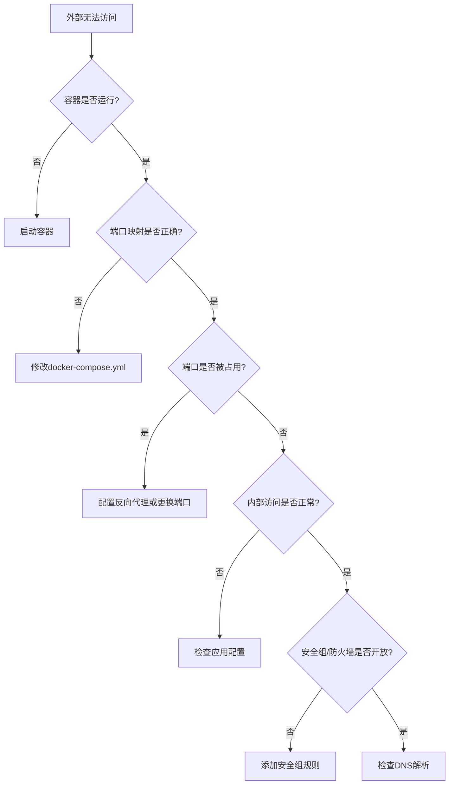

# Docker部署故障排查实战笔记

## 1. 背景与问题

### 事情从什么情况开始

按照部署文档将保险销售智能陪练系统部署到阿里云服务器上：
- **部署域名**：http://insurance.hipigod.top/
- **服务器IP**：8.138.18.77
- **部署方式**：使用docker-compose一键部署脚本

### 核心困扰

虽然严格按照文档步骤一步步执行部署：
- 部署脚本执行成功
- Docker容器状态显示healthy（健康）
- 服务器内部测试接口正常

**但**：从外部浏览器访问域名时，网页始终无法打开，连接超时。

---

## 2. 现有做法及问题

### 常规部署流程的设计

标准的Docker Compose部署流程是这样的：

```yaml
# docker-compose.yml 设计
frontend:
  ports:
    - "80:80"  # 直接将容器80端口映射到主机80端口

backend:
  ports:
    - "8000:8000"
```

**预期效果**：
- 容器启动后，用户访问域名 → 主机80端口 → 容器Nginx → 前端页面

### 现实情况的限制

**服务器环境比预期复杂**：

这台服务器上已经安装了**宝塔面板**，宝塔的Nginx服务已经在监听80端口。当我们的容器尝试绑定80端口时，由于端口冲突，部署时让Docker将容器映射到了8081端口。

**结果**：
- 容器实际监听：`0.0.0.0:8081`
- 用户访问域名：默认80端口
- 80端口由宝塔Nginx响应，但没有配置转发规则
- **访问失败**

---

## 3. 新的解决思路

### 判断方向

不是强制让容器占用80端口（这会破坏宝塔面板），而是：

**利用现有的系统Nginx作为反向代理，将请求转发到容器端口**

### 为什么这样做

1. **保持环境稳定**：不破坏已有的宝塔面板服务
2. **利用成熟方案**：系统Nginx功能完善，适合做反向代理
3. **配置简单**：只需添加一个配置文件
4. **易于维护**：符合常规运维实践

---

## 4. 关键排查过程

### 步骤1：检查容器运行状态

```bash
docker compose ps
```

**发现**：
```
insurance-frontend   0.0.0.0:8081->80/tcp   Up About an hour (healthy)
insurance-backend    0.0.0.0:8000->8000/tcp   Up 6 hours (healthy)
```

**关键线索**：前端容器映射到`8081`端口，而不是预期的`80`端口。

### 步骤2：检查80端口占用情况

```bash
netstat -tlnp | grep :80
```

**发现**：
```
tcp  0  0 0.0.0.0:80    0.0.0.0:*    LISTEN  73691/nginx: master
tcp  0  0 0.0.0.0:8081  0.0.0.0:*    LISTEN  2864894/docker-prox
```

**问题定位**：
- 80端口被系统Nginx（宝塔）占用
- 容器Nginx只能监听8081

### 步骤3：配置系统Nginx反向代理

创建配置文件：`/www/server/panel/vhost/nginx/insurance.conf`

```nginx
server {
    listen 80;
    server_name insurance.hipigod.top;

    # 前端：转发到容器的8081端口
    location / {
        proxy_pass http://localhost:8081;
        proxy_set_header Host $host;
        proxy_set_header X-Real-IP $remote_addr;
        proxy_set_header X-Forwarded-For $proxy_add_x_forwarded_for;
    }

    # 后端API：转发到容器的8000端口
    location /api {
        proxy_pass http://localhost:8000;
        proxy_set_header Host $host;
        proxy_set_header X-Real-IP $remote_addr;
    }

    # WebSocket：转发到容器的8000端口
    location /ws {
        proxy_pass http://localhost:8000;
        proxy_http_version 1.1;
        proxy_set_header Upgrade $http_upgrade;
        proxy_set_header Connection "upgrade";
    }
}
```

重载配置：
```bash
nginx -t && nginx -s reload
```

### 步骤4：测试内部访问

```bash
curl -I http://localhost:8081  # ✅ 成功
curl http://localhost:8000/api/v1/health  # ✅ 成功
curl -I -H "Host: insurance.hipigod.top" http://127.0.0.1  # ✅ 成功
```

**结论**：服务器内部一切正常，问题出在外部访问。

### 步骤5：检查阿里云安全组

**关键发现**：安全组没有开放80端口！

在阿里云控制台添加入方向规则：

| 协议类型 | 端口范围 | 授权对象 | 描述 |
|---------|---------|---------|------|
| TCP | 80/80 | 0.0.0.0/0 | HTTP访问 |
| TCP | 443/443 | 0.0.0.0/0 | HTTPS访问 |

### 步骤6：验证最终结果

```bash
# 本地电脑执行
curl -I http://insurance.hipigod.top
```

**成功**：
```
HTTP/1.1 200 OK
Server: nginx
Content-Type: text/html
Content-Length: 510
```

---

## 5. 总结与要点

### 核心结论

这次排查涉及**两个层次的问题**：

1. **端口冲突**（应用层）：
   - 宝塔Nginx占用80端口
   - 解决方案：配置反向代理

2. **安全组未开放**（网络层）：
   - 云服务商防火墙阻止访问
   - 解决方案：在控制台添加规则

### 可复用的排查思路

当Docker部署的应用无法从外部访问时，按此顺序检查：



### 实用命令清单

```bash
# 1. 检查容器状态
docker compose ps
docker ps -a

# 2. 检查端口占用
netstat -tlnp | grep :80
ss -tlnp | grep :80

# 3. 检查进程
ps aux | grep nginx

# 4. 测试内部访问
curl -I http://localhost:8081
curl http://localhost:8000/api/v1/health

# 5. 测试域名匹配
curl -I -H "Host: your-domain.com" http://127.0.0.1

# 6. 检查Nginx配置
nginx -t
nginx -T 2>/dev/null | grep "server_name"

# 7. 重载Nginx
nginx -s reload

# 8. 查看日志
docker compose logs -f
tail -f /www/wwwlogs/access.log
```

### 避坑指南

1. **不要假设服务器是干净的**：可能已经运行其他服务（宝塔、环境管理工具等）
2. **分层排查**：从容器 → 主机 → 网络，逐层向上
3. **先内后外**：确保内部访问正常再检查外部网络
4. **善用工具**：`netstat`、`curl`、`docker logs` 是你的好朋友
5. **云服务器特殊性**：除了系统防火墙，还要检查云服务商的安全组

### 关键理解

**反向代理的本质**：
就像前台接待员。客户（用户）打电话到公司总机（80端口），前台（系统Nginx）根据客户要找谁（域名判断），把电话转接到相应的分机（容器端口）。

**为什么要这样设计**：
- **解耦**：外部访问方式不变，内部可以灵活调整
- **复用**：一个80端口可以代理多个服务
- **安全**：内部端口不直接暴露给外网

---

## 附录：完整的网络架构

### 最终架构图

```
用户浏览器
    ↓
insurance.hipigod.top:80
    ↓
阿里云安全组（允许80/443）
    ↓
系统Nginx（宝塔）80端口
    ↓
根据server_name匹配insurance.conf
    ↓
    ├─→ /           → localhost:8081 → insurance-frontend容器
    ├─→ /api        → localhost:8000  → insurance-backend容器
    └─→ /ws         → localhost:8000  → insurance-backend容器（WebSocket）
```

### 文件位置清单

**服务器上的关键配置文件**：
- Nginx配置：`/www/server/panel/vhost/nginx/insurance.conf`
- Docker配置：`/opt/insurance-QA-system/docker-compose.yml`
- 环境变量：`/opt/insurance-QA-system/.env`

**日常管理命令**：
```bash
# 连接服务器
ssh root@8.138.18.77

# 进入项目目录
cd /opt/insurance-QA-system

# 查看状态
docker compose ps

# 查看日志
docker compose logs -f

# 重启服务
docker compose restart
```

---

**最后的提醒**：部署文档通常假设环境是干净的，但现实往往更复杂。遇到问题时，不要盲目照搬文档，要先观察实际情况，再灵活调整方案。
