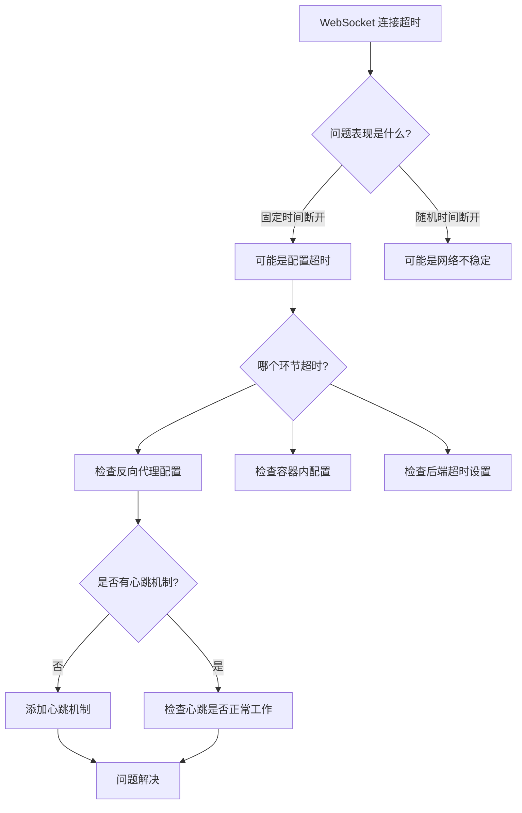

# WebSocket 1分钟超时断连问题排查与修复实战笔记

## 1. 背景与问题

### 事情从什么情况开始

将保险销售智能陪练系统部署到阿里云服务器后，功能正常运行，但遇到了一个严重的体验问题：

> **用户在进行角色扮演对话时，WebSocket 连接会在大约 1 分钟后自动断开，导致无法继续对话。**

### 核心困扰

- ✅ 系统部署成功，容器状态显示健康
- ✅ 对话功能初始正常，可以发送和接收消息
- ❌ **但连接空闲 1 分钟左右，WebSocket 自动断开**
- ❌ 用户需要刷新页面重新开始，严重影响使用体验

---

## 2. 现有做法及局限

### 之前的配置设计

在项目代码中，我们其实已经考虑到了 WebSocket 超时问题。容器内的 Nginx 配置（`frontend/nginx.conf`）中已经设置了很长的超时时间：

```nginx
location /ws {
    proxy_pass http://backend:8000;
    # ... 其他配置 ...
    proxy_connect_timeout 7d;
    proxy_send_timeout 7d;
    proxy_read_timeout 7d;  # ← 看起来已经配置了 7 天超时
}
```

**预期效果**：WebSocket 连接应该能保持 7 天不断开。

### 现实情况的限制

然而，问题依然存在。为什么配置了 7 天超时，还是 1 分钟就断开？

**关键发现**：用户的部署环境比预期复杂。

根据之前的部署文档（`docs/Docker部署故障排查实战笔记.md`），服务器上已经安装了**宝塔面板**，系统 Nginx 占用了 80 端口。实际的网络请求路径是这样的：

```
用户浏览器
    ↓
宝塔系统 Nginx (80端口) ← 真正的守门人
    ↓
容器内 Nginx (8081端口) ← 我们配置了7天超时
    ↓
后端 Spring Boot (8000端口)
```

**问题根源**：
- 容器内 Nginx 虽然配置了 7 天超时
- 但**系统 Nginx（宝塔）** 会先超时
- 系统 Nginx 的默认 `proxy_read_timeout` 是 **60 秒**
- 60 秒内没有数据传输，系统 Nginx 就主动断开连接

**就像**：你在公司打电话，前台（系统 Nginx）只让你通话 1 分钟，即使你和朋友（容器）约定聊 7 天也没用，因为前台会先掐线。

---

## 3. 新的解决思路

### 判断方向

既然问题出在系统 Nginx 的超时设置上，那么解决思路就是**两个层次同时修复**：

1. **修改系统 Nginx 配置**：将超时时间延长
2. **添加心跳机制**：主动发送数据保持连接活跃

### 为什么需要两个方案

仅修改超时配置虽然可行，但存在风险：
- 不同环境的默认超时时间可能不同
- 代理层可能有其他超时限制（如负载均衡器）
- 无法主动感知连接状态

**添加心跳机制是最佳实践**：
- 定期发送 ping/pong 消息，让连接始终"有数据传输"
- 任何中间层都不会因为没有数据而超时
- 可以主动检测连接健康状态

**类比**：
- **仅修改超时**：像告诉前台"让他们聊久一点"，但前台可能还是会忘记
- **添加心跳**：像每隔 30 秒说一声"我还在"，让前台知道通话还在进行

---

## 4. 关键排查与修复过程

### 步骤 1：定位问题层次

**排查思路**：从外到内，逐层检查

```
1. 用户浏览器 ← 看到的问题：1分钟后断开
2. 系统 Nginx ← 检查配置：发现没有配置超时参数
3. 容器 Nginx ← 检查配置：已经配置7天超时
4. 后端服务 ← 检查日志：没有异常
```

**验证方法**：
- 浏览器控制台（F12 → Network）查看 WebSocket 连接状态
- 查看 WebSocket 关闭的原因码和时间
- 确认是 60 秒左右断开

### 步骤 2：修复系统 Nginx 配置

**位置**：服务器上的 `/www/server/panel/vhost/nginx/insurance.conf`

**修改前**：
```nginx
location /ws {
    proxy_pass http://localhost:8000;
    proxy_http_version 1.1;
    proxy_set_header Upgrade $http_upgrade;
    proxy_set_header Connection "upgrade";
    # ❌ 缺少超时配置，使用默认的60秒
}
```

**修改后**：
```nginx
location /ws {
    proxy_pass http://localhost:8000;
    proxy_http_version 1.1;
    proxy_set_header Upgrade $http_upgrade;
    proxy_set_header Connection "upgrade";

    # ✅ 添加 WebSocket 超时配置
    proxy_connect_timeout 7d;
    proxy_send_timeout 7d;
    proxy_read_timeout 7d;
}
```

**重载配置**：
```bash
nginx -t && nginx -s reload
```

### 步骤 3：添加前端心跳机制

**实现逻辑**：
1. WebSocket 连接成功后，启动定时器
2. 每 30 秒发送一次 ping 消息
3. 后端返回 pong 消息
4. 连接断开时，停止定时器

**前端代码**（`frontend/src/views/Dialogue.vue`）：

```javascript
// 1. 定义心跳定时器变量
let heartbeatInterval = null

// 2. 启动心跳函数
const startHeartbeat = () => {
  // 清除可能存在的旧定时器
  stopHeartbeat()

  // 每30秒发送一次心跳
  heartbeatInterval = setInterval(() => {
    if (websocket && websocket.readyState === WebSocket.OPEN) {
      websocket.send(JSON.stringify({
        type: 'ping',
        timestamp: Date.now()
      }))
      console.log('WebSocket心跳已发送')
    } else {
      // 如果连接已断开，停止心跳
      stopHeartbeat()
    }
  }, 30000) // 30秒
}

// 3. 停止心跳函数
const stopHeartbeat = () => {
  if (heartbeatInterval) {
    clearInterval(heartbeatInterval)
    heartbeatInterval = null
  }
}

// 4. 在连接成功时启动心跳
websocket.onopen = () => {
  console.log('WebSocket connected')
  startHeartbeat()  // ← 启动心跳
  websocket.send(JSON.stringify({
    type: 'subscribe',
    session_id: sessionId.value
  }))
}

// 5. 在连接关闭时停止心跳
websocket.onclose = () => {
  stopHeartbeat()  // ← 停止心跳
  console.log('WebSocket连接关闭')
}
```

### 步骤 4：后端处理心跳消息

**前端发送的 ping 消息**：
```json
{
  "type": "ping",
  "timestamp": 1738251234567
}
```

**后端返回的 pong 消息**：
```json
{
  "type": "pong",
  "timestamp": 1738251234567
}
```

**后端代码**（`backend/ws/DialogueWebSocketHandler.java`）：

```java
// 在消息类型判断中添加 ping 处理
switch (inbound.getType()) {
  case "subscribe" -> handleSubscribe(session, inbound);
  case "chat" -> handleChat(session, inbound);
  case "end" -> handleEnd(session, inbound);
  case "ping" -> handlePing(session, inbound);  // ← 新增
  default -> sendError(session, inbound.getSessionId(), "Unknown message type");
}

// 实现心跳处理方法
private void handlePing(WebSocketSession socket, WsMessage inbound) throws Exception {
  // 心跳检测，简单返回 pong 响应
  WsMessage pong = new WsMessage();
  pong.setType("pong");
  pong.setSessionId(inbound.getSessionId());
  pong.setTimestamp(inbound.getTimestamp());
  socket.sendMessage(new TextMessage(objectMapper.writeValueAsString(pong)));
}
```

**同时需要在 WsMessage DTO 中添加 timestamp 字段**：
```java
public class WsMessage {
  // ... 其他字段 ...
  private Long timestamp;

  public Long getTimestamp() {
    return timestamp;
  }

  public void setTimestamp(Long timestamp) {
    this.timestamp = timestamp;
  }
}
```

### 步骤 5：代码部署流程

由于使用 Git 管理代码，部署流程如下：

**本地电脑**：
```bash
# 1. 提交修改
git add frontend/src/views/Dialogue.vue
git add backend/src/main/java/com/insurance/qa/ws/DialogueWebSocketHandler.java
git add backend/src/main/java/com/insurance/qa/dto/WsMessage.java

git commit -m "fix: 添加WebSocket心跳机制修复1分钟超时断开问题"

# 2. 推送到远程仓库
git push origin docker-java
```

**服务器**：
```bash
# 1. 拉取最新代码
cd /opt/insurance-QA-system
git pull origin docker-java

# 2. 重新构建容器
docker compose down
docker compose up --build -d

# 3. 查看构建日志，确认重新构建
docker compose logs -f frontend
```

**重要**：必须使用 `--build` 参数重新构建镜像，否则前端代码不会更新（因为前端代码在构建时被打包成静态文件）。

### 步骤 6：验证修复效果

**浏览器控制台观察**（F12 → Console）：

```
正在连接WebSocket: ws://insurance.hipigod.top/ws/dialogue
WebSocket connected
WebSocket心跳已发送    ← 第30秒
WebSocket心跳已发送    ← 第60秒 ← 关键测试点：之前会在这里断开
WebSocket心跳已发送    ← 第90秒
WebSocket心跳已发送    ← 第120秒
```

**Network 标签观察**（F12 → Network → WS → Messages）：

应该能看到 ping/pong 消息流：
```json
{"type":"subscribe","session_id":"..."}
{"type":"ping","timestamp":1738251234567}
{"type":"pong","timestamp":1738251234567}
{"type":"ping","timestamp":1738251234867}
{"type":"pong","timestamp":1738251234867}
```

**功能测试**：
1. 开始一个对话
2. 等待 2-3 分钟不操作
3. 发送一条消息
4. ✅ **如果能正常收发，说明问题已解决**

---

## 5. 总结与要点

### 核心结论

这次 WebSocket 超时问题涉及**两个层次**：

| 层次 | 问题 | 解决方案 |
|------|------|---------|
| **系统 Nginx** | 默认 60 秒超时 | 配置 `proxy_*_timeout 7d` |
| **应用层** | 缺少心跳机制 | 前端每 30 秒发送 ping，后端返回 pong |

**双重保障**：
- 修改超时配置：确保即使没有数据，连接也能保持
- 添加心跳机制：主动保持连接活跃，防止任何中间层超时

### 可复用的排查思路

当遇到 WebSocket 连接超时问题时，按此顺序检查：



### 实用命令清单

**本地开发**：
```bash
# 查看 WebSocket 相关代码
grep -r "websocket\|WebSocket" frontend/src/

# 测试前端构建
cd frontend
npm run build
```

**服务器排查**：
```bash
# 检查 Nginx 配置
nginx -t
cat /www/server/panel/vhost/nginx/insurance.conf

# 测试配置是否生效
nginx -s reload

# 查看容器日志
docker compose logs -f frontend
docker compose logs -f backend

# 重启服务
docker compose restart
```

**浏览器调试**：
```javascript
// 在浏览器控制台手动测试 WebSocket
const ws = new WebSocket('ws://your-domain/ws/dialogue')
ws.onopen = () => console.log('连接成功')
ws.onmessage = (e) => console.log('收到消息:', e.data)
ws.onclose = (e) => console.log('连接关闭:', e.code, e.reason)

// 手动发送 ping
ws.send(JSON.stringify({type: 'ping', timestamp: Date.now()}))
```

### 避坑指南

1. **不要假设环境是简单的**
   - 服务器上可能已有 Nginx/负载均衡器
   - 可能有多个代理层，每层都可能超时
   - 容器内配置 ≠ 实际生效配置

2. **Docker 构建的坑**
   - 前端代码在构建时打包，修改代码后必须重新构建
   - 使用 `docker compose up --build -d` 而不是 `restart`
   - 检查构建日志确认真的重新构建了

3. **浏览器缓存的坑**
   - 静态文件可能被浏览器缓存
   - 使用 `Ctrl + Shift + R` 强制刷新
   - 或者在开发者工具中禁用缓存（F12 → Network → Disable cache）

4. **Git 提交的规范**
   - 每个修复应该是一个完整的 commit
   - commit message 应该清楚说明问题和解决方案
   - 不要把不相关的修改混在一起

### 关键理解

**WebSocket 超时的本质**：

就像打电话：
- **超时配置**：告诉前台"最久让她们聊多久"
- **心跳机制**：每隔一段时间说"我还在"，让前台知道通话还在进行

**为什么要两个方案**：
- 只配置超时：依赖各个环节都配置正确，容错性差
- 只用心跳：增加了网络开销，但更可靠
- **两者结合**：既有长时保障，又有主动保活，是最佳方案

---

## 附录：完整的网络架构

### 修复后的架构

```
用户浏览器
    ↓
阿里云安全组（开放80/443）
    ↓
系统 Nginx（宝塔）80端口
    ├─ proxy_read_timeout: 7d ← 修复1
    └─ 根据 server_name 转发
         ↓
    ┌────┴────┐
    ↓         ↓
容器 Nginx  后端直接
(8081端口)  (8000端口)
    ↓         ↓
前端静态    Spring Boot
文件        WebSocket
              ↑
           每30秒 ← 修复2：心跳
           ping/pong
```

### 时序图

```
时间轴（修复后）：

0秒    ──── WebSocket 连接建立
         启动心跳定时器

30秒   ──── 前端发送 ping
         后端返回 pong

60秒   ──── 前端发送 ping ← 关键点：之前在这里断开
         后端返回 pong

90秒   ──── 前端发送 ping
         后端返回 pong

...    ──── 持续保持连接
```

---

**最后的提醒**：WebSocket 长连接的稳定性取决于整个链路的配置。不仅要检查自己能控制的代码，还要了解部署环境的实际情况。遇到问题时，**从外到内逐层排查**，往往能快速定位问题根源。
